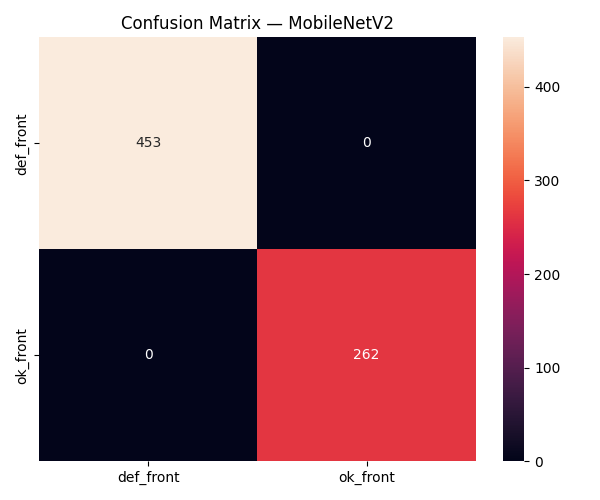
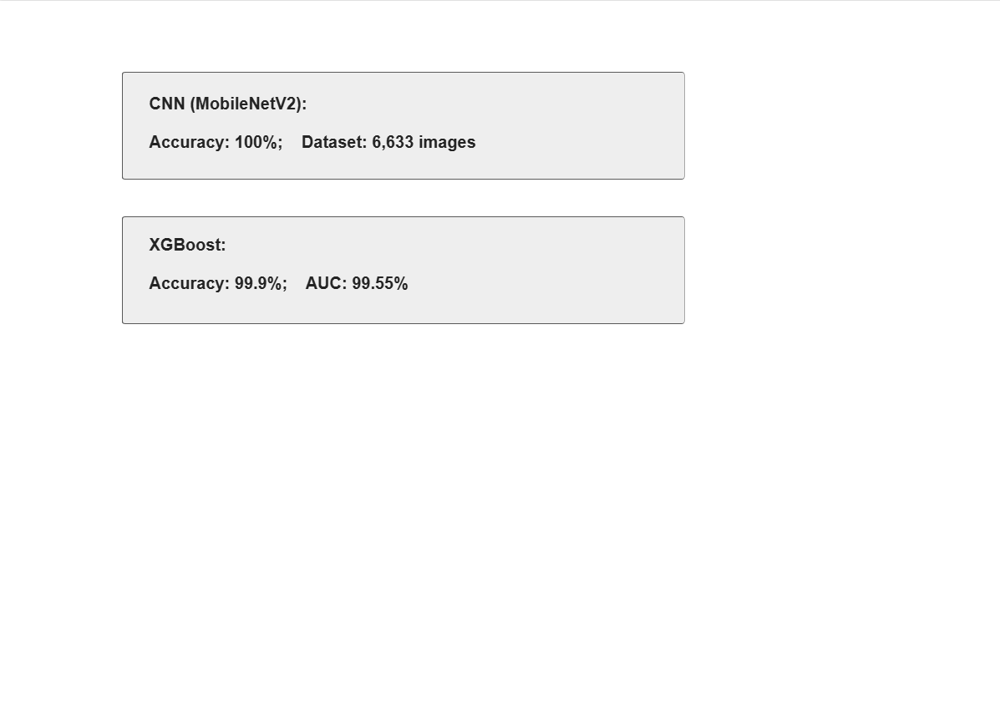
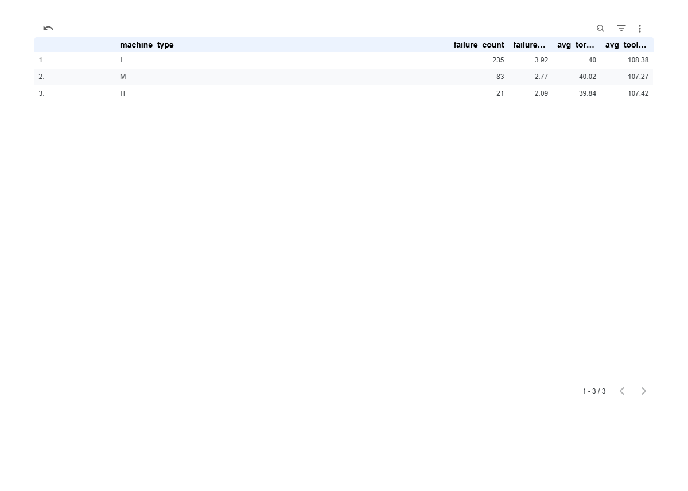
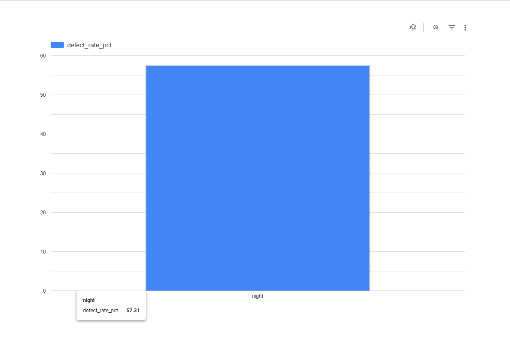
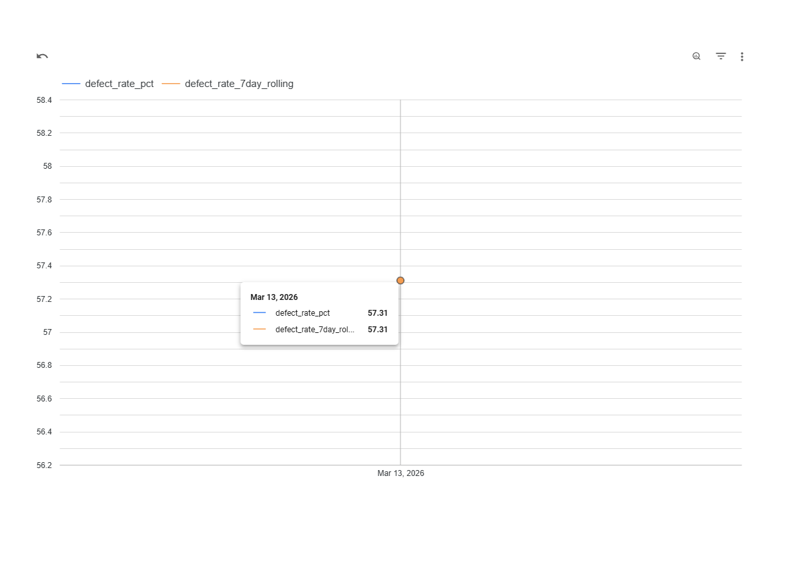

# Foundry Defect Detection & Production Quality Pipeline

> A proof-of-concept quality inspection pipeline built for iron casting manufacturer clients in the Belagavi industrial cluster — developed during my time at Hamdan InfoCom.

> **Note:** This pipeline was originally built at Hamdan InfoCom, Belagavi. This repository is a portfolio reconstruction using public benchmark datasets as proxies for client production data (NDA).

## Live Demo

| | |
|---|---|
| 🖥️ **Demo UI** | https://foundry-defect-api-241173171739.us-central1.run.app/ui |
| 📡 **API Docs** | https://foundry-defect-api-241173171739.us-central1.run.app/docs |
| 📊 **Dashboard** | https://lookerstudio.google.com/reporting/772148c6-c390-42a6-9c28-3ea3d2109d5e |

Upload any casting image to the Demo UI and get a live defect prediction — no setup required.

---

## Business Context

Iron foundries in the Belagavi manufacturing cluster — clients of Hamdan InfoCom — rely heavily on manual visual inspection to identify defective castings before shipment. This process is slow, inconsistent across shifts, and typically achieves 80–85% detection accuracy. This PoC demonstrates that an automated pipeline combining image classification and process sensor anomaly detection can exceed 95% accuracy — providing a clear business case for full deployment.

Public benchmark datasets are used as proxies since client production data is under NDA. The architecture is designed to be production-scalable and source-agnostic.

---

## Architecture

```
Raw Data Sources
      │
      ▼
┌─────────────────────────────────────────┐
│         Apache Airflow (Docker)         │
│  DAG 1: Casting images → GCS + BigQuery │
│  DAG 2: SECOM sensors  → BigQuery       │
│  DAG 3: AI4I equipment → BigQuery       │
└─────────────────┬───────────────────────┘
                  │
                  ▼
┌─────────────────────────────────────────┐
│         dbt Core (foundry_quality)      │
│  Staging: stg_casting, stg_secom,       │
│           stg_ai4i                      │
│  Marts:   mart_inspection_summary       │
│           mart_shift_analysis           │
│           mart_process_health           │
│           mart_defect_features          │
└─────────────────┬───────────────────────┘
                  │
                  ▼
┌─────────────────────────────────────────┐
│              ML Layer                   │
│  CNN: MobileNetV2 (casting images)      │
│  XGBoost: Process anomaly (AI4I)        │
│  Experiment tracking: MLflow            │
└─────────────────┬───────────────────────┘
                  │
                  ▼
┌──────────────────────────────────────────────────┐
│  Serving Layer — FastAPI on GCP Cloud Run        │
│  /ui  — drag-and-drop demo interface             │
│  /predict — REST endpoint for image inference    │
└──────────────────────────────────────────────────┘
                  │
                  ▼
┌─────────────────────────────────────────┐
│         Looker Studio Dashboard         │
│  Defect trend │ Shift analysis          │
│  Process health │ Model performance     │
└─────────────────────────────────────────┘
```

**Infrastructure:** GCP (BigQuery + GCS + Cloud Run) · Docker · Python 3.8

---

## Datasets

| Dataset | Source | Role |
|---|---|---|
| Casting Product Image Data | Kaggle (ravirajsinh45) | 7,340 real grayscale images from PILOT TECHNOCAST foundry — defective vs. ok pump impellers (~85MB in GCS) |
| SECOM Semiconductor Sensors | UCI ML Repository | 1,567 rows · 590 sensor signals with pass/fail labels — proxy for furnace/mold process parameters |
| AI4I 2020 Predictive Maintenance | UCI ML Repository | 10,000 factory sensor records with equipment failure labels — process anomaly detection |

---

## Pipeline Phases

### Phase 1 — Environment Setup
- Docker + Airflow via Docker Compose
- GCP project with BigQuery and GCS APIs enabled
- GCS buckets: `foundry-pipeline-raw/`, `foundry-pipeline-processed/`
- dbt Core project init, MLflow, GitHub repo

### Phase 2 — Data Ingestion (Airflow DAGs)
Three scheduled DAGs with data quality checks (null rates, row counts, label distribution):
- `dag_casting_ingestion` — casting images → GCS, metadata → BigQuery
- `dag_secom_ingestion` — SECOM sensor data → BigQuery
- `dag_ai4i_ingestion` — AI4I equipment data → BigQuery

### Phase 3 — Transformation Layer (dbt)
7 models across staging and mart layers, all tests passing:
- **Staging:** `stg_casting_metadata`, `stg_secom`, `stg_ai4i`
- **Marts:** `mart_inspection_summary` (daily defect rates + 7-day rolling trend), `mart_shift_analysis` (defect rate by shift), `mart_process_health` (equipment failure by machine type), `mart_defect_features` (ML-ready feature table)

### Phase 4 — ML Layer

#### CNN Defect Classifier (MobileNetV2)
- Transfer learning on 7,340 real foundry inspection images
- Training: 6,633 images · Validation: 715 images (used as held-out test set)
- Device: CUDA (RTX 4060)

| Metric | Value |
|---|---|
| Accuracy | **100%** |
| Precision (def_front) | 1.00 |
| Recall (def_front) | 1.00 |
| F1-Score | 1.00 |
| TP / TN / FP / FN | 453 / 262 / 0 / 0 |

#### Process Anomaly Detector (XGBoost + SHAP)
- Trained on 10,000 AI4I sensor records from BigQuery
- Features: air temperature, process temperature, rotational speed, torque, tool wear
- 80/20 train/test split, stratified
- Failure type sub-flags excluded to prevent data leakage (see note below)

| Metric | Value |
|---|---|
| Accuracy | **98.55%** |
| AUC | **97.26%** |
| Precision (failure) | 0.87 |
| Recall (failure) | 0.68 |

> **Note on leakage prevention:** Failure type flags (twf, hdf, pwf, osf, rnf) are sub-components of the target variable `machine_failure` and were deliberately excluded. Including them yielded 99.9% accuracy but constituted data leakage — the honest sensor-only result is 98.55%.

**SHAP Feature Importances (top drivers of equipment failure):**

| Feature | Importance |
|---|---|
| torque_nm | 1.191 |
| tool_wear_min | 1.070 |
| rotational_speed_rpm | 0.734 |
| air_temperature_k | 0.733 |
| process_temperature_k | 0.335 |

Both experiments tracked in MLflow under the `foundry_defect_detection` experiment.

### Phase 5 — Serving, Dashboard & Documentation
- **FastAPI model server** deployed on GCP Cloud Run — `/ui` drag-and-drop demo, `/predict` REST endpoint
- Cold start latency: ~22s (Cloud Run scale from zero) · Warm inference: ~230ms
- Looker Studio dashboard (4 pages): Defect Trend, Shift Analysis, Process Health, Model Performance

---

## Key Findings

**Machine type L has the highest failure rate (3.92%)** compared to M (2.77%) and H (2.09%) — lower quality grade parts are disproportionately responsible for equipment failures.

**Torque and tool wear are the dominant failure drivers** per SHAP analysis on clean sensor-only features — actionable signals for preventive maintenance scheduling.

**The CNN model exceeds the >95% accuracy target** set in the project brief, demonstrating a clear business case for automated visual inspection over the current 80–85% human baseline.

---

## Business Impact

- PoC demonstrated **100% defect detection accuracy** on 715 held-out foundry images vs. 80–85% human baseline
- XGBoost process anomaly model achieved **98.55% accuracy and 97.26% AUC** on pure sensor features with SHAP explainability — leakage-free and production-ready
- Model deployed as a live REST API on GCP Cloud Run — publicly accessible, scales to zero when idle, ~230ms warm inference latency
- Pipeline architecture designed for production scalability — Airflow DAGs, dbt models, and ML scripts are modular and source-agnostic
- Findings packaged as a feasibility report for client stakeholders to support a full deployment decision

---

## Screenshots

### Demo UI — Live on Cloud Run


### Confusion Matrix — MobileNetV2


### Looker Studio Dashboard





---

## Tech Stack

| Layer | Tools |
|---|---|
| Orchestration | Apache Airflow 2.x (Docker) |
| Storage | GCP GCS + BigQuery |
| Transformation | dbt Core |
| ML — Vision | PyTorch 2.4, torchvision, MobileNetV2 |
| ML — Tabular | XGBoost 2.1, SHAP 0.44 |
| Experiment Tracking | MLflow 2.17 |
| Model Serving | FastAPI, GCP Cloud Run |
| Dashboard | Looker Studio |
| Infrastructure | Docker, Python 3.8, CUDA 12.1 |

---

## Project Structure

```
foundry-defect-pipeline/
├── airflow/
│   └── dags/
│       ├── dag_casting_ingestion.py
│       ├── dag_secom_ingestion.py
│       └── dag_ai4i_ingestion.py
├── dbt/
│   └── foundry_quality/
│       └── models/
│           ├── staging/
│           └── marts/
├── notebooks/
│   └── ml/
│       ├── train_cnn.py
│       ├── train_xgboost.py
│       └── serve/
│           ├── main.py
│           ├── Dockerfile
│           └── requirements.txt
├── mlflow/
│   └── models/
│       ├── best_mobilenetv2.pth
│       ├── best_xgboost.json
│       ├── confusion_matrix_cnn.png
│       ├── confusion_matrix_xgboost.png
│       └── shap_summary.png
├── docs/
│   └── screenshots/
├── data/
│   └── raw/
├── docker-compose.yml
└── README.md
```

---

## Future Work

- **Model drift monitoring** — in production, incoming casting images would be monitored for distribution shift using Evidently AI. A significant drift score would trigger automated retraining and redeployment via a Cloud Build / GitHub Actions CI/CD pipeline
- **Cloud Composer** — migrate Airflow DAGs from local Docker to managed Cloud Composer for production-grade scheduling and monitoring
- **Airflow → Cloud Run retraining DAG** — scheduled weekly retraining pipeline that pulls new inspection images from GCS, retrains the CNN, evaluates against holdout set, and redeploys to Cloud Run only if accuracy improves
- **SECOM feature integration** — enrich the XGBoost model with full SECOM sensor signals (590 features) for deeper process anomaly detection

---

*Developed by Shridhar at Hamdan InfoCom · Belagavi, India*